# Ujian-Akhir-Semester
## Adam Surya Ananda(312110297)

OK DI,PROGRAM  package dan modul dengan struktur'
'

A. MODEL'
'
1. daftar_nilai.py'
'
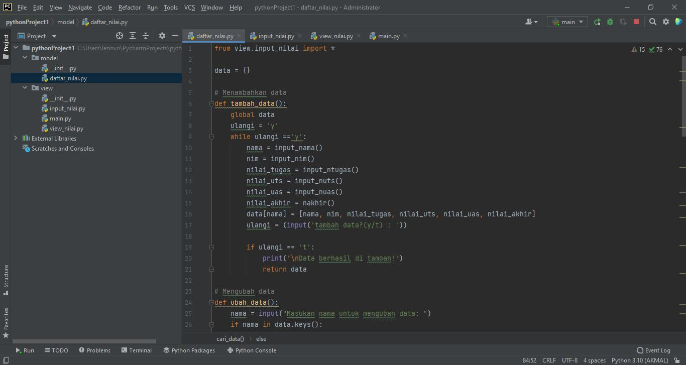
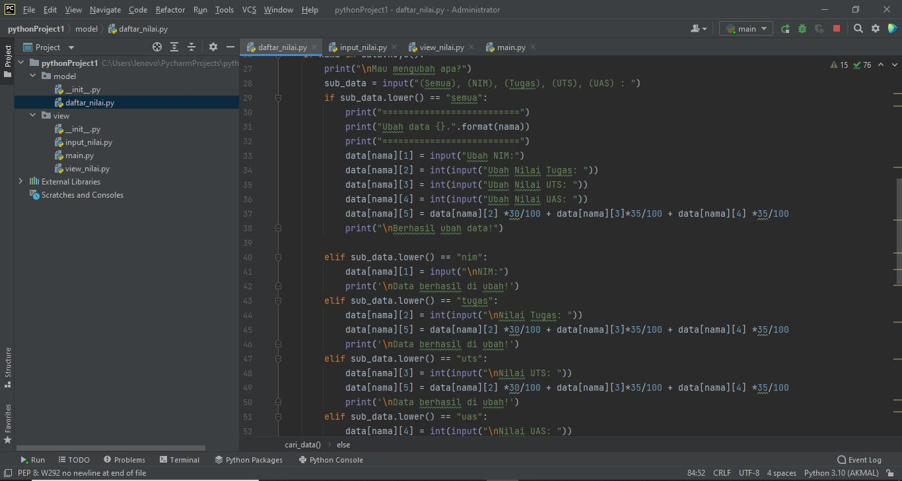
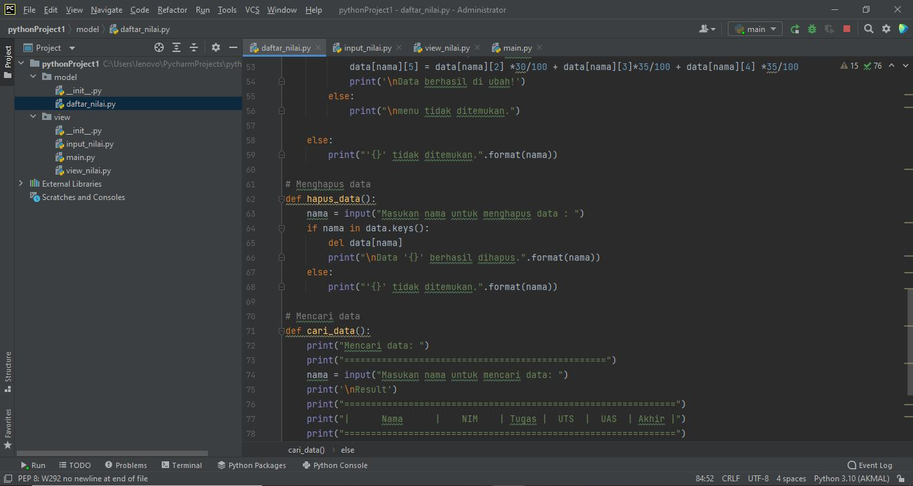
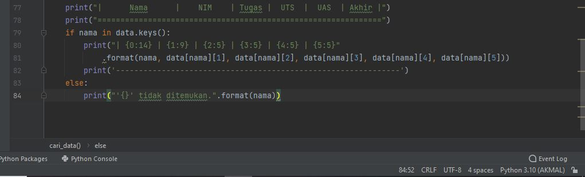

B. VIEW'
'
1. input_nilai.py'
'
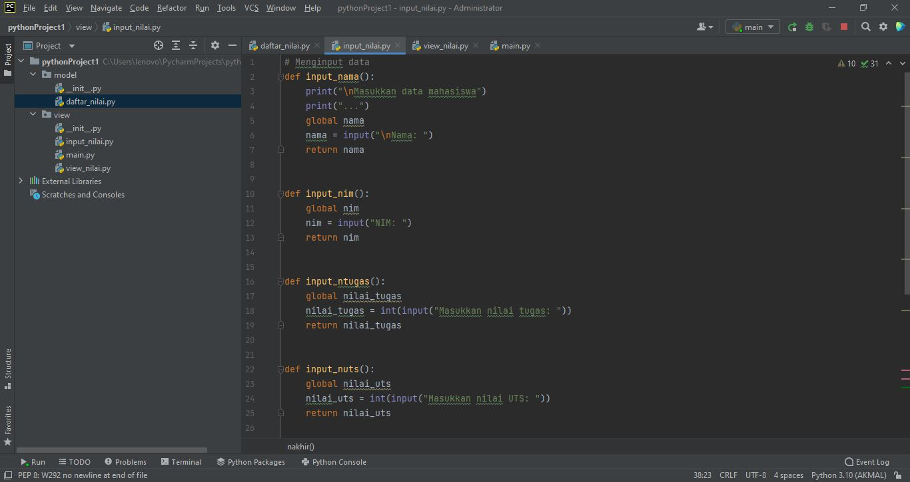

2. view_nilai.py'
'
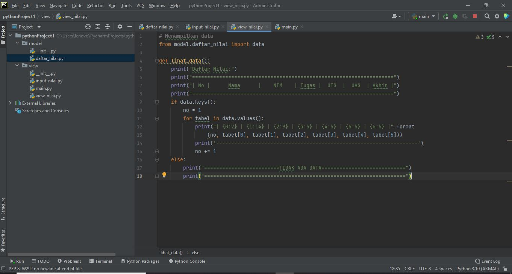
3. main.py'
'

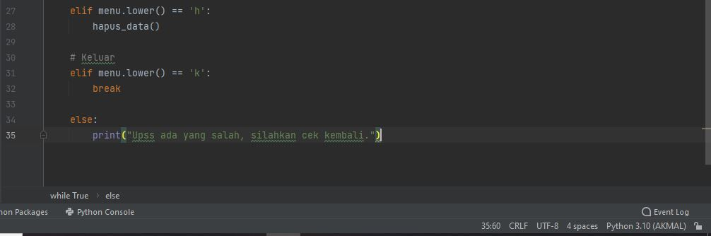
APA BILA PROGRAM DI ATAS DI RUN HASILNYA AKAN SEPERTI DI BAWAH!'
'
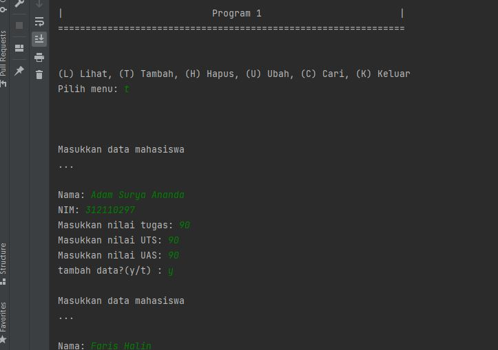
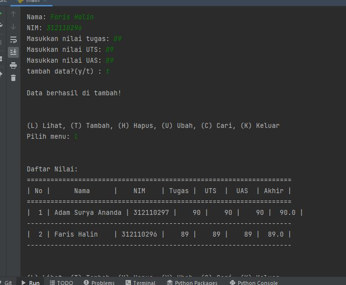
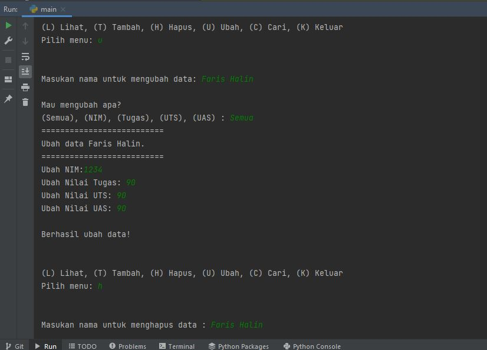
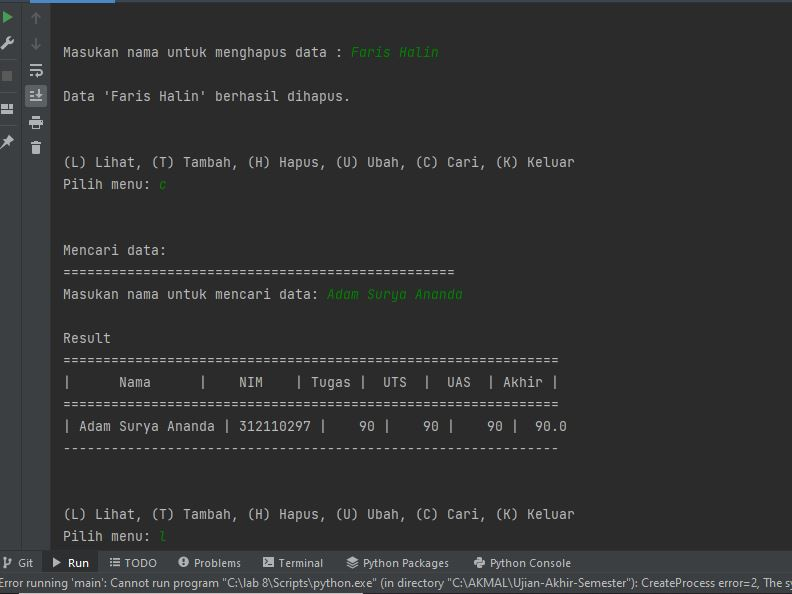

